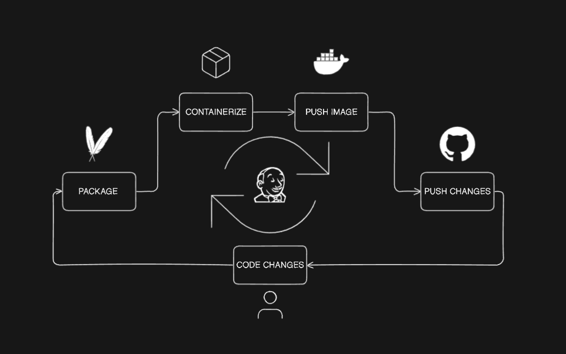

# Java-Maven-App

A simple java app packaged ,containerized and pushed to docker hub all automted with jenkins

It's preferable to build the app in a multibranch pipeline due of the usefull plugins that only work with multibranch piplines

## Setting up a webhook trigger :
    
    * add "Multibranch Scan Webhook Trigger" plugin and add a token
    * configure a webhook in the git repo webhook settings :
        - <jenkins-url>/multibranch-webhook-trigger/invoke?token=<token>

## Packaging the app :

    * maven plugin must be installed and configured in jenkins 
    * add maven in the jenkins tool section 
    * incrementing the app version using maven plugins 
    * the old version of the app in the target folder must be deleted evry time there is an update :
        - mvn clean package

## Containerizing and pushing :

    * create a dockerfile 
    * set the image version same as the app
    * login to docker hub using "withCredentials" plugin
    * push the image 

## Pushing version changes :

    * configuring jenkins to push the version update to the git repo 
    * a plugin called "Ignore Commiter Strategy" is needed to avoid entering in a pushing building infinite loop 
    * this way evry time a feature is added a build get's triggered automaticly ,increments the app version and pushes the changes to the git repo
