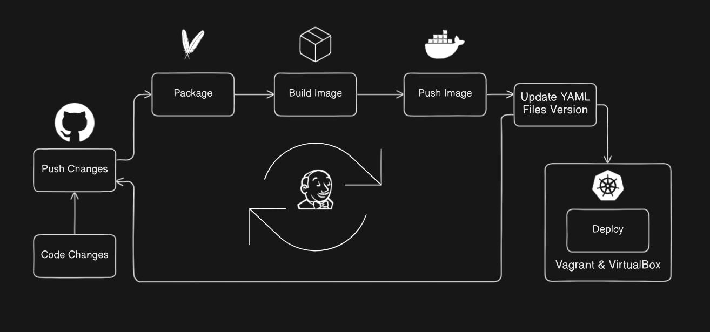
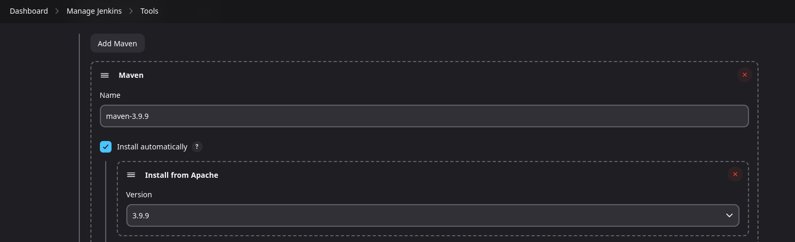
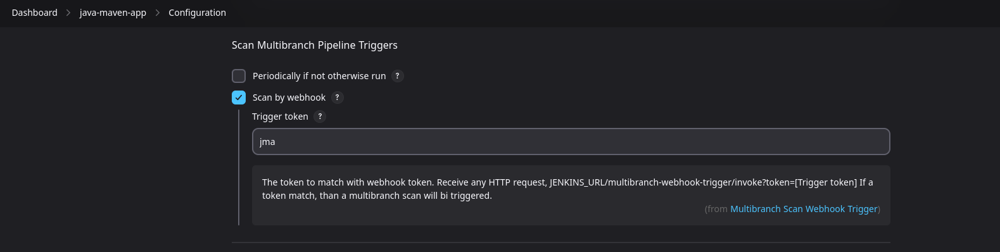
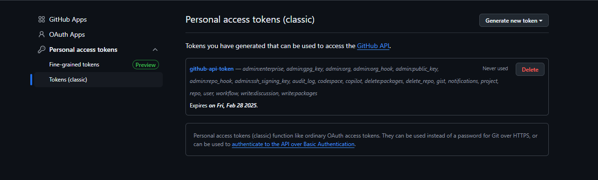
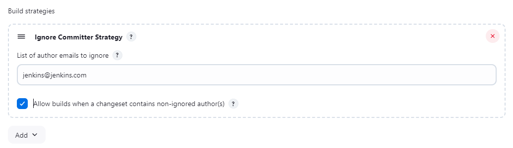
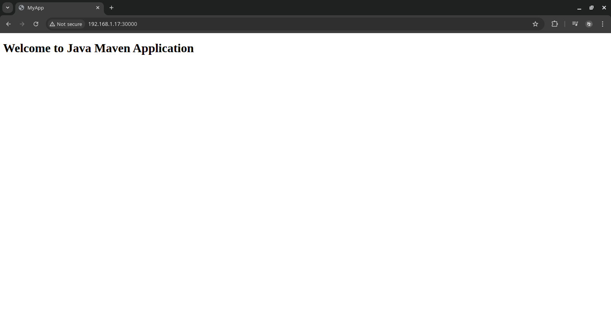
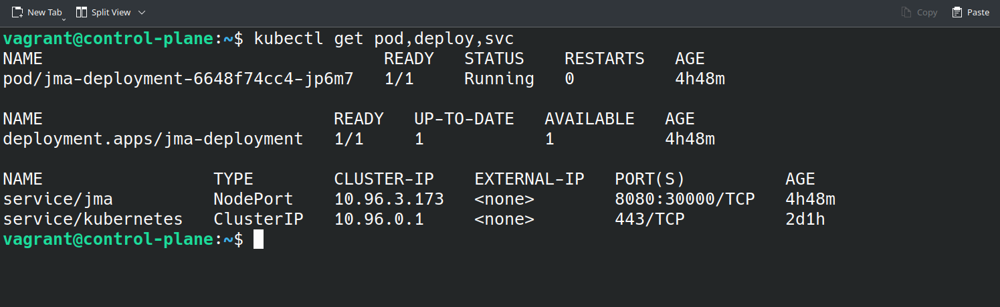
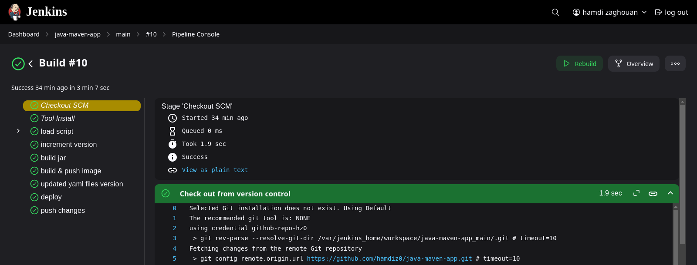

# Java-Maven-App

A simple java app built ,packaged ,containerized and deployed all automted with a CI/CD pipline using jenkins , maven, docker and an on premesis kubernetes cluster setup with kubeadm using vagrant and virtualbox

- [Prerequisites](#prerequisites-)
- [Architecture](#architecture-)
- [Infrastructure and Tools](#infrastructure-and-tools-)
    - [Setting up a Kubernetes cluster](#setting-up-a-kubernetes-cluster-)
    - [Setting up Jenkins](#setting-up-jenkins)
- [YAML files](#yaml-files-)
- [CI/CD Pipeline](#cicd-pipeline)
  - [CI Pipeline](#ci-pipeline-)
    - [Building, Packaging, and Versioning the App](#building-packaging-and-versioning-the-app-)
    - [Building & Pushing Docker Images](#building--pushing-docker-images-)
    - [Changing the YAML Files Image Version](#changing-the-yaml-files-iamge-verion-)
    - [Pushing the Version Change](#pushing-the-version-change-)
  - [CD Pipeline](#cd-pipeline-)
- [Results](#results-)

## Prerequisites :
* Jenkins (as a container)
* Docker
* Git/Github
* Kubernetes

## Architecture :



## Infrastructure and Tools :

### Setting up a Kubernetes cluster :

* here is guide on how to setup a k8s cluster with vagrant and kubeadm <a href="https://github.com/vancanhuit/vagrant-k8s">vagrant-k8s</a>

* here is a minikube quik setup repo <a href="https://github.com/hamdiz0/minikube-setup">minikube-setup</a>

### Setting up Jenkins

* follow this guide to set up jenkins as a container <a href="https://github.com/hamdiz0/LearningDevOps/blob/main/jenkins/README.md#doker-in-jenkins">Docker in Jenkins</a>

* make sure docker is setup in jenkins (more details <a href="https://github.com/hamdiz0/Learning-DevOps/tree/main/jenkins#doker-in-jenkins">here</a>)

* it's preferable to use a multibranch pipeline cause of the usefull plugins and features it provides

* make sure maven is installed and configured in jenkins 



* add "Multibranch Scan Webhook Trigger" plugin in jenkins 



* configure a webhook in the git repo webhook settings :
    - `<jenkins-url>/multibranch-webhook-trigger/invoke?token=<token>`

* more details about multibranch webhooks <a href="https://github.com/hamdiz0/Learning-DevOps/blob/main/jenkins/README.md#multibranch-triggers-">here</a>

* cofingure the connection to the k8s cluster in jenkins using the kubeconfig file
    - in the kubernetes master node retrive the kubeconfig file content :
        ```bash
        kubectl config view --raw
        ```
    - create a file in the jenkins container and paste the content of the kubeconfig file in it :
        ```bash
        docker exec -it jenkins bash
        ```
        ```bash
        nano /kubecfg/config
        ```
* note that the certicates and keys must be the actual data not just paths pointing to the files containing it, this is specificly for minikube 

## YAML files :

* set up a deployment for the app along with a ClusterIP service to expose it externally :
    - view the <a href="k8s-manifests/deployment.yml">deployment.yml</a>
    - view the <a href="k8s-manifests/service.yml">service.yml</a>


## CI/CD Pipeline

### CI Pipeline :

* the CI pipeline is triggered by a webhook evry time a push is made to the git repo

#### building ,packaging and versioning the app :

* the app is built and packaged using maven

    ```bash
    mvn clean package   // delete the old version and package the app
    ```

* than the version is incremented ,in this case the minor version is incremented while the major version is kept the same :

    ```groovy
    sh 'mvn build-helper:parse-version versions:set \
    -DnewVersion="\\\${parsedVersion.majorVersion}.\\\${parsedVersion.nextMinorVersion}" \
    versions:commit'
    // read the new incremented version from pom.xml
    def match = readFile('pom.xml') =~ '<version>(.+)</version>'
    def version = match[0][1]           // get the first match (application version in pom.xml)
    env.IMAGE_VERSION = "$version"      // set the version environment variable
    ```
#### Building & Pushing docker images :

* utilzed a function to build and push the image to docker hub using the same versioning as the app :
    - view the funtcion <a href="./script.groovy">here</a>
    - example :
        ```
        gs.image_build(
            'hamdiz0/java-maven-app',   // image name
            IMAGE_VERSION,              // version
            'docker-repo',              // credentailsID for DockerHub in jenkins
            '.'                         // dockerfile location in the git repo
        )
        ```

#### Changing the YAML files iamge verion :

* utilized a script to change the demployment image version <a href="./k8s-manifests/change_version.sh">change_version.sh</a>
* the update_yaml_version function takes the path to the yaml files, the script name and the image version as arguments (the script must be in the same directory as the yaml files) :
    ```groovy
    gs.update_yaml_version(
        "k8s-manifests",            // yaml files and script location (same directory)
        "change_version.sh",        // change version script name (.sh)
        IMAGE_VERSION              
    )
    ```
### Pushing the version change :

* set up jenkins to update the git repository with new version
* set up a git user.name and user.eamil for jenkins :
    ```
    docker exec -it jenkins bash
    git config --global user.name "jenkins"
    git config user.email "jenkins@jenkins.com"
    ```
* ustilized a function that adds and push changes to a git repository 
    - view the function <a href="./script.groovy">here</a>
* the function uses a git access token wish must be configured and added to jenkins as a `Username and Password` credential
    - set up an access token in git hub :
    
* make sure to add the `Ignore Commiter Strategy` plugin and ignore jenkins pushes to avoid infinite build loops :
    
* example of using the function :
    ```groovy
    gs.git_push(
        'github.com/hamdiz0/java-maven-app.git',    // url without "https://"
        'github-api-token',                         // credentialsId
        "updated to version ${IMAGE_VERSION}",      // commit message
        'main'                                      // branch
    )
    ```
### CD Pipeline :

* after the "updated yaml files version" stage the "deploy" stage is triggered 
* the deploy function runs the <a href="./k8s-manifests/deploy.sh">deploy.sh</a> script wich applies the changes to the k8s cluster :
    ```groovy
    gs.deploy(
        "k8s-manifests",            // yaml files location
        "deploy.sh",                // deployment script name (.sh)
        KUBECONFIG_PATH,            // kubeconfig absolute path in the jenkins container
    )
    ```
* the function takes three arguments : the path to the yaml files, the script name and the kubeconfig path in the jenkins container
* the yaml files must be in the same directory as the script

## Results :




